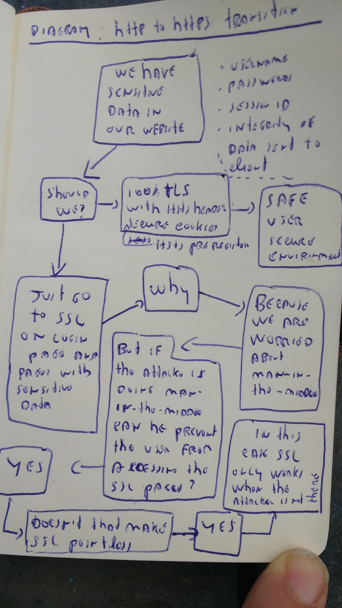

### Http to https transition

Text in diagrams

  - We have sensitive data in our website
    - username
    - password
    - session IDs
    - Integrity of data sent to clients
  - Show We?
    - 100% TLS with HSTS headers, secure cookies and HSTS pre-registration
      - Safe use, secure environment
  - Just go to SSL on login page and pages with sensitive data
    - Why?
    - Because we are worried about man-in-the-middle attacks
    - But if an attacker is doing man-in-the-middle, can't he prevent the user from accessing the SSL pages?
    - Yes!
    - Doesn't that make SSL pointless?
    - Yes!
    - In this case SSL only works when the attacker is not there

**raw**

