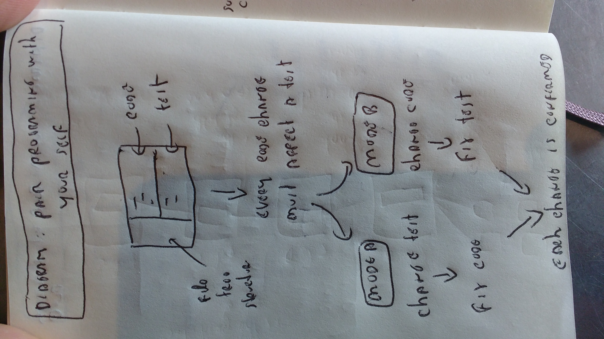

### Pair programming with myself

- this diagram shows the TDD (Test Driven Development) workflow where the developer is always making two changes (i.e programming in pair with himself). 
  - a code change is followed by a test change
  - a test change is followed by a code change
  

Here is the text for the diagram below (top to bottom)

- Code
- Test
- File Tree Structure
- Every code change must affect a test
- Mode A
  - change test
  - fix code
- Mode B
  - change code
  - fix text
- each change if confirmed

