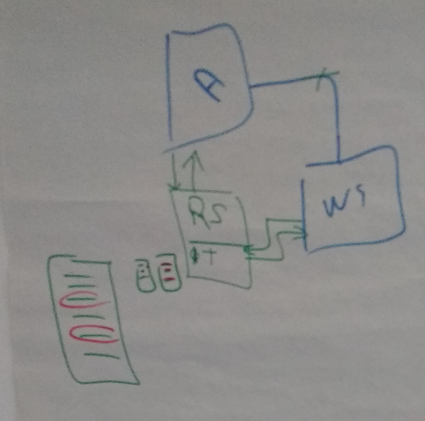
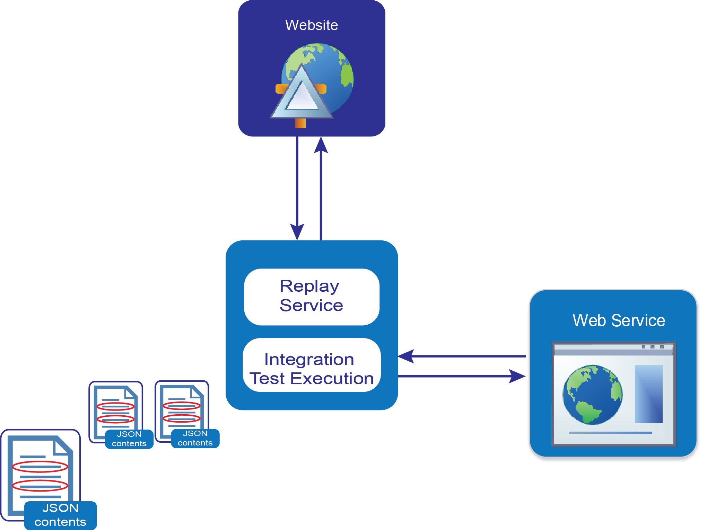

### Web Services Repeater

What I'm trying to show here (not my best drawing) is a special type of test environment which allows the replay of content from a dependent web service

  - the A box is a website
  - the WS box is a Web Service
  - the Green box has two parts
    - T : Integration tests execution which invoke the WS (this data is saved as JSON, which is what the 3 rectangles to the left of the green box represent)
    - RS : Replay Service (which replays the JSON back to A)
  - the red circles inside the 3 rectangles) represent security tests injected inside the JSON content that is feed back to the A website

**draft diagram**

**work in progress diagrams**

comments:

 - split into multiple graphs, each showing the sequence of events
    - show just execution of 'Integration tests'
    - show the saving of data in json with no payloads
    - show the replay of json data (with no payloads)
    - add icon of user simulated request on the website
    - add path of website hitting the Web Service directly
    - add DB to WebService
    - add path of using Mock Web Service (from website)
  - on the website and webservices boxes
    - need to find a better icon to represent it
    - put the title outside the box
  - find way to represent the fact that the JSON data is saved from the WebService call
  
 - make the images smaller
