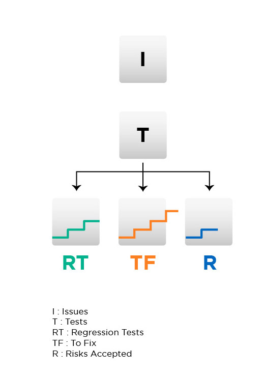

### Issue risk lifecycle

- this is a flow of how security issues should be handled.

Legend:
  - I : Issues
  - T : Tests
  - RT (left box) : Regression Tests
  - TF (middle box): To Fix
  - R (right box): Risks Accepted

the lines inside the boxes are supposed to be unit tests execution graphs

**v0.1:**

**raw:**

