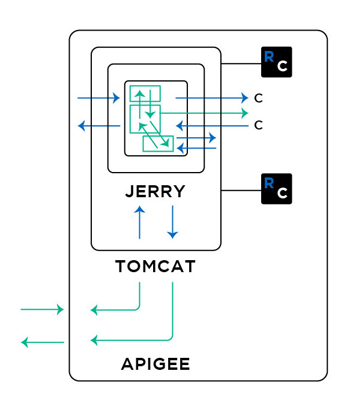
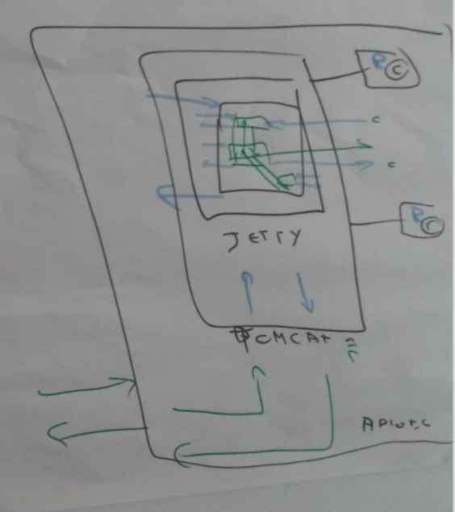

### 8.Writing tests at multiple levels

  - this diagram represents the multiple types of tests that need to be executed (from Unit tests, all the way to integration tests). The last layer is called Apigee

**v0.1**

**raw**

