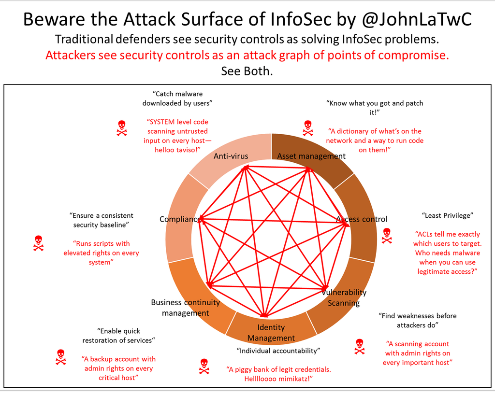

## Security Software

  - the category of software that is focused on solving security problems

### Why security products tend to be bad at security

  - here is an interesting question: 'When adding product XYZ, do you have a net gain of security?'
    - when you add up the benefit of the new product and subtract the security issues created by it (i.e. the security vulnerabilities that exist that product), do you have a positive value?
      - This also applies for Services
  - (list past examples of security vulnerabilities discovered in security products: RCE in antivirus and Firewalls, open services, high access to assets)
  - Security products tend to be exposed to [^infosec-insecurity]

 [^beware-infosec]

[^infosec-insecurity]: "How InfoSec Security Controls Create Vulnerability", https://blogs.technet.microsoft.com/johnla/2016/02/20/how-infosec-security-controls-create-vulnerability/

[^beware-infosec]: @JohnLaTwC ,  https://twitter.com/JohnLaTwC/status/699304590500634625

### The big missed opportunity in getting developers as users

  - most security product are about increasing visibility (or reducing attack surface), both things that are very valuable to developers

(add section on Visibility)
